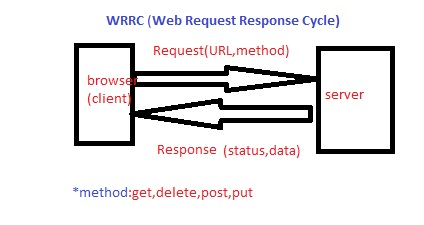
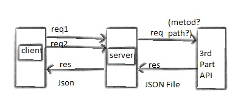
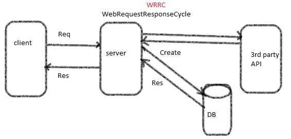

# Movies-Library

# Movies-Library - 1.0.0

**Author Name**: Heba Alhamaydh

## WRRC

## Overview

## Getting Started
1. npm init -y
2. create index.js
3. install express package to use it npm install express
4. added the server code inside 'index.js'
5. run the server using 'node index.js'

## Project Features

1. handle the server error (status 500)
2. handle "page not found error" (status 404)
3. Create a constructor function to ensure your data follow the same format (i dont need to send all data to the client)
## Get 3rd Party data from an API
### Give me the recipe data

# Create request to the database
